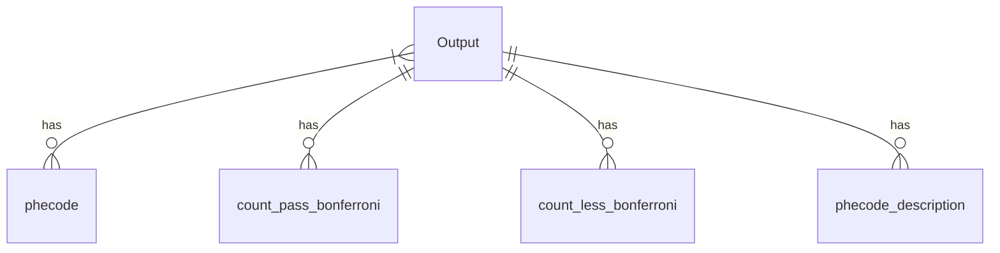

# UML to design the plugin with the phecode counts

```mermaid
erDiagram
          Output }|--o{ phecode : has
          Output ||--o{ count_pass_bonferroni : has
          Output ||--o{ count_less_bonferroni : has
          Output ||--o{ phecode_description: has
```